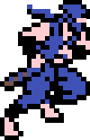

# BOX-SHADOW SPRITES

### This project tries to explore a different way of creating sprites for games or other uses.

The conventional technique could be using a file image, such as a png file. Here, we are going to create sprite animations with CSS as source by using `box-shadow` property.

The current example shows how to create a sprite for a character, that can be controlled by the arrow keys. This sprite is composed by different CSS classes that contain a `box-shadow` pixel art drawing. Switch between frames is managed with JavaScript.

The art has been created with [Pixel Art to CSS](https://github.com/jvalen/pixel-art-react) tool, giving us the CSS code ready to use.

(Demo sprite: Ninja Gaiden)
